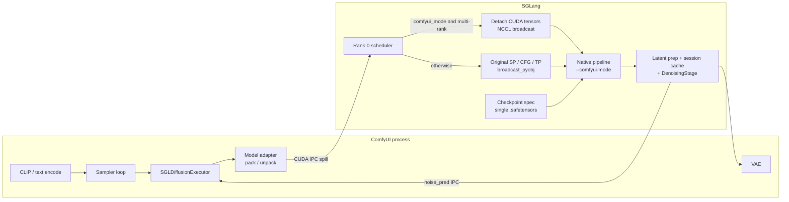

# ComfyUI SGLDiffusion Plugin

A ComfyUI plugin for SGLang Diffusion. Server mode talks to a standalone HTTP
server. Integrated mode keeps ComfyUI's CLIP / VAE / sampler loop and uses
SGLang only as a per-step DiT forward.

Integrated mode no longer ships dedicated `comfyui_*` pipelines. It starts the
native Flux / Qwen-Image / Z-Image / MiniMax-H3 pipeline under `--comfyui-mode`,
loads a single-file ComfyUI `.safetensors` (or GGUF overlay) through a
checkpoint spec, and translates each `apply_model` call through a small
per-model adapter.

## Installation

1. **Install SGLang**: Follow the [Installation Guide](https://docs.sglang.io/docs/sglang-diffusion/installation) to install `sglang[diffusion]`.
2. **Install Plugin**: Copy this entire directory (`ComfyUI_SGLDiffusion`) to your ComfyUI `custom_nodes/` folder.
3. **Restart ComfyUI**: Restart ComfyUI to load the plugin.

## Usage

The plugin supports two modes of operation: **Server Mode** (via HTTP API) and **Integrated Mode** (tight integration with ComfyUI).

### Supported Models
- **Z-Image**: High-speed image generation models (e.g., `Z-Image-Turbo`)
- **FLUX**: State-of-the-art text-to-image models (e.g., `FLUX.1-dev`)
- **Qwen-Image**: Multi-modal image generation models (e.g., `Qwen-Image`,`Qwen-Image-2512`). *Note: Image editing support is currently experimental and may have some issues.*
- **Qwen-Image-2.1**: Integrated mode (`model_type=qwen_image21`, auto-detected) for Comfy-Org's single-file `qwen_image_2.1_bf16.safetensors` or the serialized INT8 ConvRot `qwen_image_2.1_int8_convrot.safetensors`. Text-to-image and reference-image edit (`TextEncodeQwenImage21` with images, up to the node's 16 references) follow the official templates; swap `UNETLoader` for `SGLDUNETLoader`. The text/reference prefix K/V is cached on the SGLang worker for each sampler run; `Qwen Image 2.1 Cache` `device` (auto / gpu / cpu / off) is honoured, its int8 / int4 `dtype` is not (the cache stays bf16). DiT model patches (Fun-Control, attention hooks) are not supported in integrated mode. LoRA: use `SGLDiffusion LoRA Loader` (diffusers / ComfyUI-format Qwen-Image-2.1 LoRAs, e.g. Viggle's 6-step turbo LoRA); a `LoraLoaderModelOnly` wired to an SGLD model raises. On the bf16 DiT the LoRA is merged into the weights (like ComfyUI's loader); on the INT8 ConvRot DiT it runs unmerged (dynamic), which costs about 35% per step. Multi-GPU (`SGLDOptions`, `num_gpus=2`): `sp_degree=2` (Ulysses) or `tp_size=2` split each DiT call; `enable_cfg_parallel` instead runs each step's cond and uncond on one GPU each (CFG split, needs CFG > 1; steps with area / mask / hooks / ControlNet conds fall back to ComfyUI's sequential path).
- **MiniMax-H3**: Joint video-and-audio DiT (`model_type=minimax_h3`). Integrated mode: T2V / I2VA / FL2VA use an `fl2va` checkpoint; R2V needs `ref2va`. CLIP and VAE stay in ComfyUI. Server mode uses `SGLDiffusion Generate MiniMax-H3`.

### Mode 1: Server Mode (HTTP API)
Connect to a standalone SGLang Diffusion server.

1. **Start SGLang Diffusion Server**: Ensure the server is running and accessible.
2. **Connect to Server**: Use the `SGLDiffusion Server Model` node to connect (default: `http://localhost:3000/v1`).
3. **Generate Content**:
   - `SGLDiffusion Generate Image`: For text-to-image and image editing.
   - `SGLDiffusion Generate Video`: For text-to-video and image-to-video.
   - `SGLDiffusion Generate MiniMax-H3`: For joint video-and-audio on a standalone server.
4. **LoRA Support**: Use `SGLDiffusion Server Set LoRA` and `SGLDiffusion Server Unset LoRA`.

### Mode 2: Integrated Mode (Tight Integration)
ComfyUI keeps CLIP, VAE, and the sampler loop. SGLang loads only the DiT and
runs one forward per sampler step (pass-through scheduler, no text encode /
decode on the worker).

1. **Load Model**: Use the `SGLDiffusion UNET Loader` node to load your diffusion model.
2. **Configure Options**: Use the `SGLDiffusion Options` node to set runtime parameters like `num_gpus`, `tp_size`, `model_type`, or `enable_torch_compile`.
3. **Sample**: Connect the loaded model to standard ComfyUI samplers. Each step is packed by a model adapter and sent to the SGLang scheduler.
4. **LoRA Support**: Use the `SGLDiffusion LoRA Loader` for native LoRA integration.

## Adding a Model

Pick the mode before writing code; the wrong one costs several hundred lines
of weight mapping that buys nothing.

Take **Server Mode** when the model needs conditioning ComfyUI cannot supply
(audio, reference materials, task routing), emits more than one modality, or
has its own request contract. Reproducing that inside ComfyUI would duplicate
stages the server already runs.

- If the request fits the existing `generate_image` / `generate_video` fields,
  there is nothing to write — point the existing nodes at the server.
- If the model has extra request fields, pass them via `extra_fields`. The
  request schemas accept unknown keys, so `core/server_api.py` needs no
  per-model change.
- Add a node in `nodes.py` only to surface those inputs as ComfyUI widgets.
  `SGLDiffusionGenerateH3` is the worked example.

Take **Integrated Mode** only when the model denoises a single latent tensor
that ComfyUI already knows how to build and decode, so its KSampler can drive
the loop unchanged. Each model then needs:

- `runtime/pipelines/comfyui_<model>_pipeline.py` mapping ComfyUI's
  single-file checkpoint layout onto the native module tree (350-690 lines in
  the existing three)
- an executor in `executors/` adapting latent layout and conditioning to `Req`
- entries in both `pipeline_class_dict` and `executor_class_dict` in
  `core/generator.py`

## Example Workflows

Reference workflow files are provided in the `workflows/` directory:

- **`flux_sgld_sp.json`**: Multi-GPU (Sequence Parallelism) workflow for FLUX models. High-performance inference across multiple cards.
- **`qwen_image_sgld.json`**: Qwen-Image generation with LoRA support. Optimized for multi-modal image tasks.
- **`z-image_sgld.json`**: High-speed image generation using Z-Image.
- **`sgld_text2img.json`**: Server-mode text-to-image generation with LoRA support.
- **`sgld_image2video.json`**: Server-mode image-to-video generation.
- **`qwen_image21_t2i_sgld.json`** / **`qwen_image21_edit_sgld.json`**: Qwen-Image-2.1 text-to-image and reference edit (official templates without the prompt-enhancer branch).
- **`qwen_image21_turbo_lora_sgld.json`**: Qwen-Image-2.1 with the Viggle turbo LoRA (`Qwen-Image-2.1-viggle-turbo-v0.3-6step-lora-r128.safetensors` in `models/loras`) through `SGLDLoraLoader`: 6 steps, euler, no CFG, the LoRA's 1024x1024 sigma schedule via `ManualSigmas`.
- **`minimax_h3_t2v_sgld.json`**: MiniMax-H3 T2V / I2VA / FL2VA (`fl2va` DiT).
- **`minimax_h3_r2v_sgld.json`**: MiniMax-H3 reference-to-video (`ref2va` DiT).
- **`minimax_h3_t2v_sgld_upscaler.json`**: H3 two-pass latent upscale (low-res then 3D ×2 refine).

For other workflows supporting the models, you can easily use SGLang by replacing the official `UNET Loader` node with the `SGLDUNETLoader` node. Similarly, for LoRA support, replace the official LoRA loader with the `SGLDiffusion LoRA Loader`.

To use these workflows:
1. Open ComfyUI.
2. Load the workflow JSON file from the `workflows/` directory.
3. Adjust the parameters and model paths as needed.
4. Run the workflow.

### CFG split (`enable_cfg_parallel`)

ComfyUI runs CFG itself: each sampler step evaluates the positive and the
negative cond, one `apply_model` per cond (batched only when their shapes
match). With `enable_cfg_parallel` and `num_gpus=2`, models that support it
(`supports_cfg_split` on the executor; Qwen-Image-2.1) install a
`CALC_COND_BATCH` wrapper that sends both cond calls of a step as one worker
request; CFG rank `i` runs cond `i` and the velocities are all-gathered, so a
step costs about one DiT forward. The wrapper reproduces `_calc_cond_batch`
for two plain conds (strength, timestep range) and leaves everything else
(area / mask conds, hooks, ControlNet, GLIGEN, model wrappers, CFG = 1) to
ComfyUI. It cannot be combined with `sp_degree` / `tp_size`.

## Current Implementation

SGLang's optimized kernels and parallelism (TP / SP, compile, cache) run on the
DiT only. Text encoding and VAE stay in ComfyUI.

## Architecture

Per sampler step:

1. The adapter turns ComfyUI `apply_model` tensors into an SGLang `Req`.
2. Local ZMQ pickle replaces CUDA tensors with IPC handles so latents stay on GPU.
3. Rank 0 materializes the handles. Multi-rank `--comfyui-mode` then detaches CUDA tensors and broadcasts them over NCCL; the general SP / CFG / TP path is still the original whole-list `broadcast_pyobj`.
4. The worker pipeline is the native model class with modules trimmed to `transformer` + pass-through scheduler. A single-file checkpoint goes through `comfyui_checkpoints`. After the first step, conditioning stays in a worker session; later steps send latents and the timestep.

Adding a model means a checkpoint spec plus a `ComfyUIModelAdapter`. There is no extra ComfyUI pipeline class.
